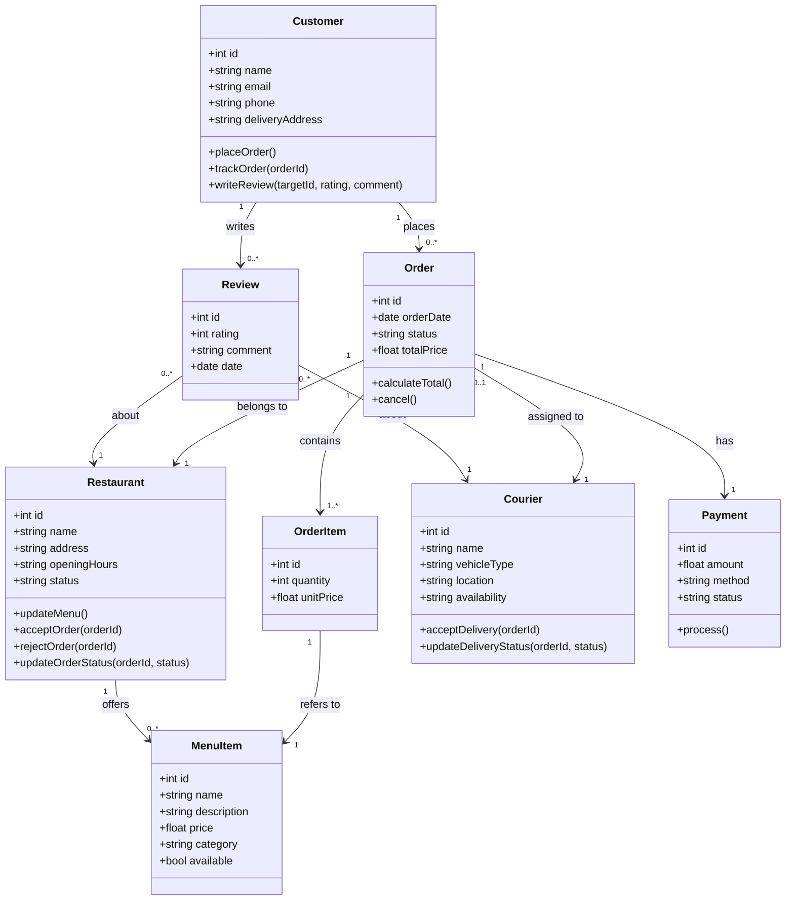

# Task 1 - Class Diagram: Food Delivery Platform

## Design Justifications

- **Customer → Order (1 to 0..*)**: A customer may have zero orders (new account) or many over time.
- **Order → Restaurant (1 to 1)**: Each order is placed at exactly one restaurant — no mixed-restaurant orders.
- **Order → OrderItem (1 to 1..*)**: An order must contain at least one item.
- **Order → Courier (0..1 to 1)**: An order may not yet have a courier assigned (pending), but once assigned, exactly one courier delivers it.
- **Order → Payment (1 to 1)**: Every order requires exactly one payment record.
- **Restaurant/Courier ← Review (1 to 0..*)**: Reviews are optional feedback, so zero or many per target.
