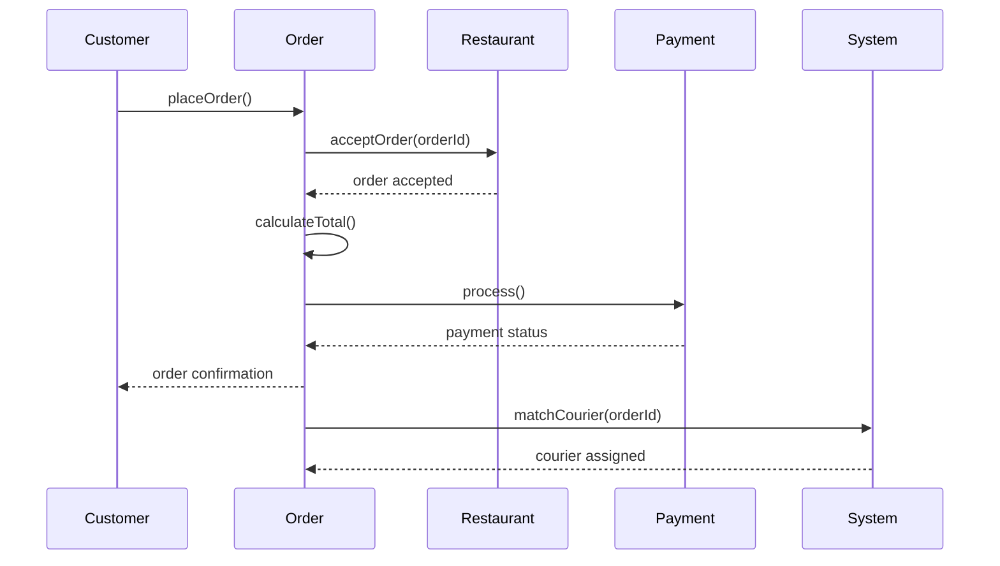
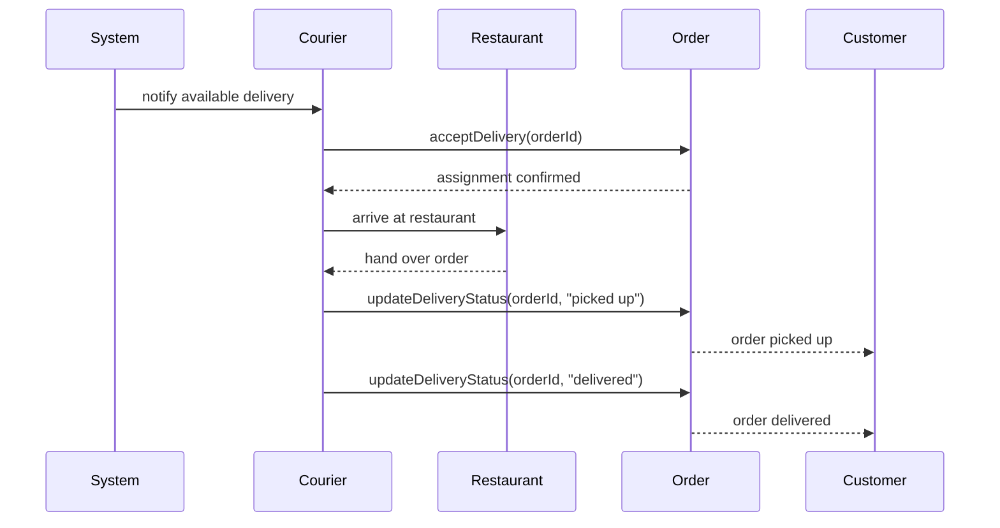
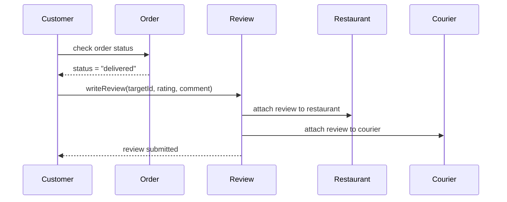

# Task 2 - Sequence Diagrams: Food Delivery Platform

## 1. Place an order (mandatory use case)

## 2. Courier delivers an order

## 3. Customer writes a review

## Design Notes

- **Place an order** is the mandatory flow: customer triggers payment processing and courier matching happens automatically after confirmation.
- **Courier delivery** shows the courier as an active participant updating order status, which the customer observes via the Order object (consistent with Order being the central state-holder in the class diagram).
- **Review** can only be submitted after order status is "delivered", enforcing the assumption from Task 0 that reviews are tied to completed orders.
